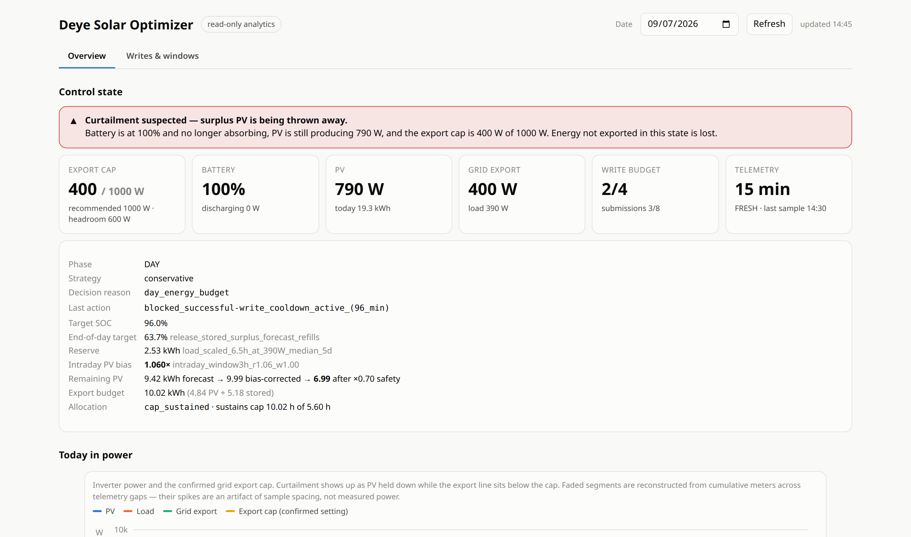
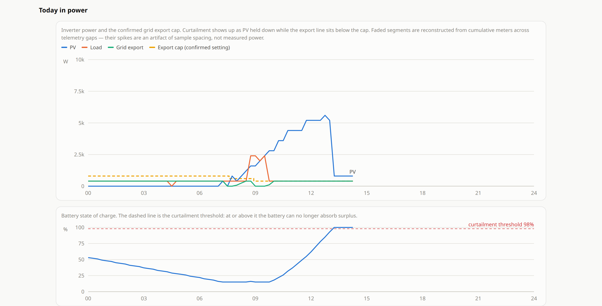
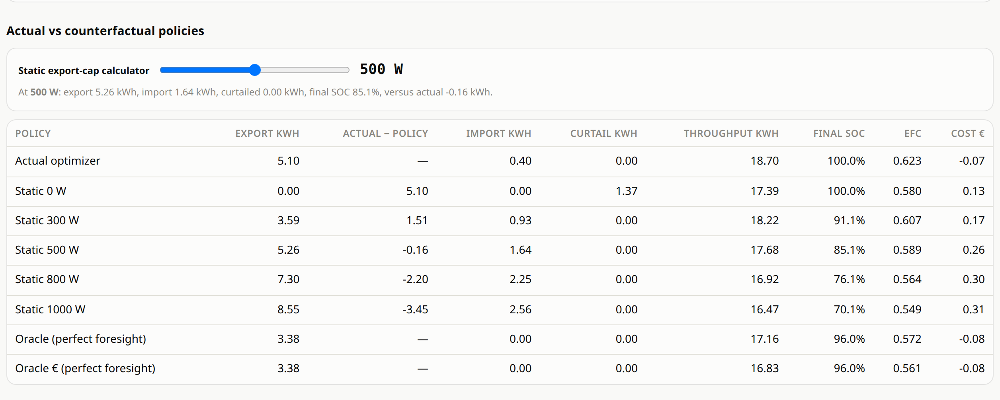
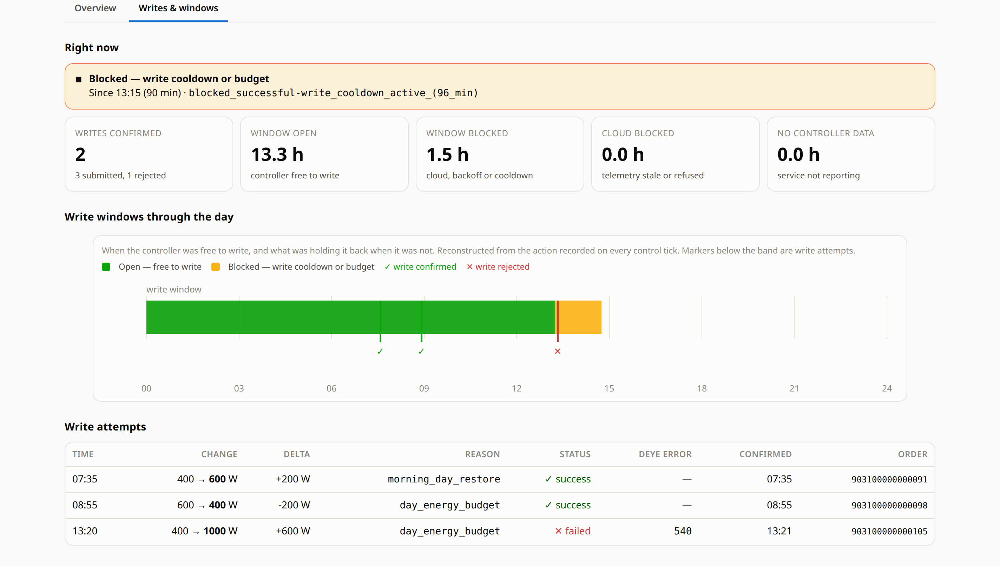
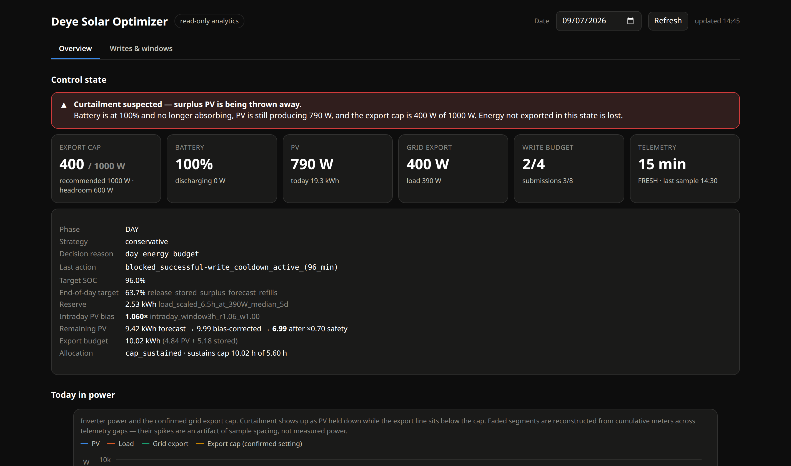

# Deye Solar Optimizer

Forecast-aware export optimizer for a grid-tied Deye hybrid inverter with a **hard
export limit** and a battery. It decides one thing well: what to set
`MAX_SELL_POWER` to, and when, so that as much energy as possible leaves the house
over 24 hours without leaving the battery short overnight — using very few inverter
writes.

Runs as a systemd service against the Deye Cloud API. No local Modbus, no vendor
app, no cloud service of its own. A separate read-only dashboard scores what it did
against counterfactual policies and a perfect-hindsight oracle.

**Documentation**

| Document | What it covers |
|---|---|
| this file | install, upgrade, configuration, strategies, diagnostics, calibration |
| [ARCHITECTURE.md](ARCHITECTURE.md) | how decisions are made and why each guard exists |
| [PRIVACY.md](PRIVACY.md) | what is not published here, and keeping your data out of git |
| [CHANGELOG.md](CHANGELOG.md) | release history |
| [README_LT.md](README_LT.md) | Lithuanian summary |

## What you need

**Hardware**

- A Deye hybrid inverter with a battery, reporting to Deye Cloud through its logger
  (the Wi-Fi/LAN stick). If the phone app shows live data, the API will too.
- A grid connection with an **export limit**. Without one, most of this project is
  pointless: there is nothing to ration.

**Accounts** — two, and you need both

| | Where | What it is |
|---|---|---|
| Deye Cloud account | the phone app / [deyecloud.com](https://deyecloud.com) | the account that owns the plant — the one you already log in with |
| Developer application | [developer.deyecloud.com](https://developer.deyecloud.com) | register, then create an application; the portal issues an **App ID** and **App Secret** |

The two are not interchangeable. Authentication is a single call that sends the app
pair *and* the account pair together, so a developer key alone cannot read your
inverter, and your app login alone cannot reach the API.

Approval of a developer application is not instant — allow for a wait before you can
finish setup.

**A machine to run it on**

- Any always-on Linux box with Python 3.9+ and outbound HTTPS. A Raspberry Pi is
  ample: the loop is one API call a minute and the database grows by a few MB a month.
- systemd, for the two services the installer creates.
- No local network access to the inverter is needed. Everything goes through Deye
  Cloud, so the optimizer can run anywhere, not just on the same LAN.

**Five required values**

Startup fails with a named error if any is missing:

| Key | Where to find it |
|---|---|
| `DEYE_APP_ID` | developer portal, on your application |
| `DEYE_APP_SECRET` | developer portal, issued with the App ID |
| `DEYE_LOGIN` | your Deye Cloud account email |
| `DEYE_PASSWORD` | your Deye Cloud account password — SHA-256 hashed by this client before it is sent, never transmitted in clear text |
| `DEYE_INVERTER_SN` | the inverter's serial, on its label and in the app under the device. **The inverter, not the logger stick** — the two have different serials and orders addressed to the logger fail |

Everything else has a working default. In particular `DEYE_STATION_ID` is **optional**:
it is used only by `deyeopt-preflight` for one diagnostic read and never by control,
so leaving it at `0` is fine.

One value you must get right by hand: `GRID_EXPORT_HARD_LIMIT_W`, your contracted
export limit in watts. Every setpoint is clamped to it. Nothing can discover it for
you, and setting it too high is a breach of your grid agreement.

Then check `DEYE_BASE_URL` matches the region your developer account was issued for
(`eu1` for Europe). A wrong region authenticates successfully and then reports your
inverter as unknown, which is a confusing way to fail.

## The dashboard

A separate read-only service scores what the optimizer did against policies it did
not run. All screenshots below come from generated demo data — see
[Try it without an inverter](#try-it-without-an-inverter).

### Control state

Every number the controller acted on, including the ones that used to be invisible:
the confirmed export cap against the recommendation, the remaining write budget, and
the full decision chain from raw forecast to allocated setpoint.

The banner fires on the situation this project exists to catch — battery at its
ceiling, no longer absorbing, PV still producing, and the export cap left below the
limit. Surplus in that state is not stored, it is thrown away.



### Today in power

PV, load, grid export and the *confirmed* export cap on one shared axis, over a
battery SOC panel marked with the curtailment threshold. Here the cap was throttled
to 400 W mid-morning; the battery fills by early afternoon and PV is visibly clipped
because there is nowhere left for it to go.



### Was it actually any good?

The day is replayed against static export caps, a perfect-foresight oracle and an
economic oracle, from the same measured PV and load. This is the honest scoreboard:
it will happily show that a dumb fixed cap would have beaten the optimizer.



### Writes and windows

Whether a write landed, and if not, what stood in the way. The band is reconstructed
from the action recorded on every control tick, so it is the real gate history rather
than a guess. Confirmed and rejected writes are marked on it, and the table surfaces
the device error code behind a rejection.



### Dark mode



## Try it without an inverter

The dashboard runs against a generated database, so you can see all of the above
without any hardware or credentials:

```bash
python3 tools/make_demo_data.py --out /tmp/deye-demo/state.db
python3 dashboard_server.py --env tools/demo.env --port 8850
# open http://127.0.0.1:8850/
```

`tools/make_demo_data.py` invents a 10 kWp site behind a 1 kW export limit and
reproduces the situations the optimizer is built for: a clear day whose surplus a
1 kW cap cannot carry, a curtailment episode, a cloud stall, and a device-rejected
order. It contains no real measurements.

> **Status:** this drives real hardware. It is deliberately conservative: it refuses
> to write on stale telemetry, budgets flash writes, and clamps every setting to a
> configured export limit. Read [ARCHITECTURE.md](ARCHITECTURE.md) before changing
> the control path, and commission with `DRY_RUN=true` first.

The project is designed around a conservative rule: **read often, write rarely**. It uses `/device/latest` for telemetry, Open-Meteo for PV forecasting, a local SQLite history for learning/calibration, and guarded `MAX_SELL_POWER` writes for export control.

> **Safety:** inverter settings can affect grid export and battery behavior. Start with `CONTROL_DRY_RUN=true`, verify your legal export ceiling, and commission on-site. The software never raises `MAX_SELL_POWER` above `GRID_EXPORT_HARD_LIMIT_W`.

## v3 highlights

- One runtime configuration file: `/etc/deye-solar-optimizer/deye.env`.
- `.env.example` is safe to commit; the real `deye.env` is ignored by Git.
- Deye credentials, site coordinates, PV arrays/angles, battery parameters, export limits, heater/cooker schedules, forecast assumptions and write-safety limits all live in `.env`.
- Five quick strategy tags: `conservative`, `risky`, `max-export`, `save`, `economic`.
- Water heater and cooker are modeled as scheduled flexible loads. The optimizer **does not switch them**; it only budgets their expected energy.
- Confirmed `status=500` failed Deye orders no longer consume the normal successful-write budget.
- Default write policy: 4 confirmed successful changes/day, optional 5th only for a large change (default >=500 W), plus a separate 8-submission anti-storm ceiling.
- Compact diagnostics: `deye-day-export --hours 6` exports only the requested time window.
- Cloud-stall protection is based on `collectionTime`, not HTTP success.


## v3.1 analytics and learning

v3.1 keeps the inverter-control loop small and conservative, and adds a separate **read-only analytics layer**. The dashboard never sends a Deye control command.

Implemented analytics/experiments:

- historical **counterfactual replay** for static export caps (default `0/300/500/800/1000 W`);
- an interactive export-cap slider for arbitrary caps;
- a **perfect-foresight oracle** benchmark with a required end-of-day SOC target;
- a second oracle that optimizes configured import/export prices and battery-wear cost;
- actual-vs-forecast cumulative PV and forecast-revision history;
- delayed **probabilistic forecast learning** (`P10/P20/P50/P80/P90`) grouped by forecast lead-time;
- adaptive morning-PV timing bias after enough post-v3.1 days have been observed;
- battery throughput, equivalent-full-cycle, high-SOC/low-SOC and C-rate statistics;
- rough PV-curtailment estimation when the battery is full and export is constrained;
- per-MPPT observed-energy learning with optional MPPT-to-array mapping;
- rolling actual-vs-static strategy and economic comparison.

The water-heater timing experiment and generic appliance scheduler are intentionally **not** part of v3.1. Existing heater/cooker entries remain planning inputs only.

### Dashboard

The installer creates a second systemd service:

```bash
sudo systemctl status deye-solar-analytics
```

Default address:

```text
http://127.0.0.1:8787/
```

It binds to localhost by default. If you want remote access, reverse-proxy it explicitly rather than exposing it blindly, or tunnel it over SSH:

```bash
ssh -L 8787:127.0.0.1:8787 <host>   # then open http://127.0.0.1:8787/ locally
```

The page opens on the **control state**: the confirmed export setpoint against the hard limit, the current recommendation and the unused headroom, the decision reason and last action, the remaining write and submission budgets, and telemetry health. A banner fires when the live state says the battery is full, no longer absorbing and PV is still producing — the signature of curtailment. Below that are an intraday power timeline with the confirmed export-cap steps, a battery SOC panel marked with the curtailment threshold, and cumulative forecast-vs-achieved. All charts share one minute-of-day axis, so a partial day reads as a partial day. Segments reconstructed from cumulative meters across telemetry gaps are drawn faded.

Configuration:

```env
ANALYTICS_ENABLED=true
ANALYTICS_BIND="127.0.0.1"
ANALYTICS_PORT=8787
ANALYTICS_REPLAY_CAPS_W="0,300,500,800,1000"
```

CLI equivalent:

```bash
sudo deyeopt-analytics
sudo deyeopt-analytics --date 2026-09-04
sudo deyeopt-analytics --date 2026-09-04 --cap 600
sudo deyeopt-analytics --days 30
```

### What the counterfactual means

The replay uses measured/cumulative-meter-reconstructed PV and house load as the available energy stream, then re-simulates battery SOC under alternative export caps. Therefore changing an export cap changes future SOC, curtailment, imports and battery throughput. It is not the naive `min(PV, export_limit)` calculation.

Long cloud-telemetry gaps are reconstructed from Deye cumulative daily-energy counters, which preserves total energy reasonably well but loses intra-gap timing. The dashboard reports data coverage and labels curtailment estimates as approximate.

### Probabilistic forecast activation

Probabilistic control is pre-wired but deliberately dormant at first:

```env
FORECAST_PROBABILISTIC_ENABLED=true
FORECAST_PROBABILISTIC_MIN_DAYS=10
FORECAST_PROBABILISTIC_LEARNING_DAYS=45
FORECAST_PROBABILISTIC_QUANTILES="0.10,0.20,0.50,0.80,0.90"
```

Forecast errors are grouped by information state (`day_ahead`, `00-06`, `06-09`, `09-12`, `12-15`, `15-24`). After enough completed comparable days, the optimizer learns multipliers for P10/P20/P50/P80/P90 from:

```text
actual daily PV / predicted daily PV
```

Until the minimum sample count is reached, the existing explicit safe-factor logic remains in control. This prevents a two- or three-day sample from pretending to be a probability model.

### Adaptive morning timing

From v3.1 onward full 15-minute forecast points are stored. After at least `MORNING_LEARNING_MIN_DAYS` suitable days, the controller compares forecast sustained-PV start against actual sustained-PV start and applies the median timing error, clamped by `MORNING_LEARNING_MAX_ABS_MINUTES`. Before enough data exists, learned bias is exactly zero.

### Economic mode and analytics

```env
ECONOMIC_IMPORT_EUR_KWH=0.25
ECONOMIC_EXPORT_EUR_KWH=0.00
ECONOMIC_BATTERY_WEAR_EUR_KWH=0.00
```

These values drive the economic oracle and the optional live `economic` strategy. With static prices, deliberate battery-to-grid export is considered worthwhile only when export revenue exceeds the modeled future replacement-import cost (adjusted for discharge efficiency) plus configured battery-wear cost. Otherwise the strategy preserves battery and exports only forecast-safe surplus.

This is intentionally a **static-price** mode. It does not yet fetch Nord Pool or supplier tariffs and does not model time-of-use prices. Leave the normal strategy at `conservative` until the three price values have been set deliberately.

### MPPT learning

If you know which inverter MPPT corresponds to which configured array:

```env
ANALYTICS_MPPT_MAP_JSON='{"PV1":"east","PV2":"west"}'
```

The dashboard integrates `DCPowerPV1..4` and compares observed MPPT energy against the matching forecast-array energy. Leave `{}` until the physical mapping is known.

## Quick start

```bash
cp .env.example deye.env
nano deye.env
sudo ./install.sh --env-file ./deye.env
sudo python3 /opt/deye-solar-optimizer/preflight.py
sudo systemctl restart deye-solar-optimizer
sudo deyeopt-status
```

Fresh installs default to:

```env
CONTROL_DRY_RUN=true
STRATEGY_ACTIVE="conservative"
```

After observation/commissioning, explicitly set `CONTROL_DRY_RUN=false` only when you are satisfied that telemetry, export direction and hard limits are correct.

## Upgrade from v2.x / v3.0

```bash
sudo ./upgrade.sh
```

Legacy appliance schedules are preserved. If the physical heater timer is changing during the upgrade, override only its planning time explicitly:

```bash
sudo ./upgrade.sh --water-heater-time 10:00
```

If `/etc/deye-solar-optimizer/deye.env` does not exist, v3 automatically converts:

- `/etc/deye-solar-optimizer/config.toml`
- `/etc/deye-solar-optimizer/credentials/app-id.txt`
- `/etc/deye-solar-optimizer/credentials/app-secret.txt`
- `/etc/deye-solar-optimizer/credentials/login.txt`
- `/etc/deye-solar-optimizer/credentials/login-pass.txt`

into a single mode-`0640` root/deyeopt `deye.env` file. Existing SQLite history and `CONTROL_DRY_RUN` are preserved. v3.1 also appends newly introduced `.env` keys with defaults without overwriting existing values.

## Configuration

The complete set of supported keys is documented in `.env.example`. Important groups:

### Deye credentials

Five required values, one optional. See [What you need](#what-you-need) for where
each comes from.

```env
# Required - the developer application (developer.deyecloud.com)
DEYE_APP_ID="..."
DEYE_APP_SECRET="..."

# Required - your ordinary Deye Cloud account, as used by the phone app
DEYE_LOGIN="you@example.com"
DEYE_PASSWORD="..."

# Required - the INVERTER serial, not the logger stick's
DEYE_INVERTER_SN="..."

# Regional endpoint; must match the region your developer account was issued for
DEYE_BASE_URL="https://eu1-developer.deyecloud.com/v1.0"

# Optional - diagnostic only, never used for control. 0 disables it.
DEYE_STATION_ID=0
```

Both credential pairs are needed together. Authentication is one
`POST /account/token?appId=...` carrying the app secret, your account email and a
SHA-256 hash of your password; the plaintext password never leaves the machine. A
developer key on its own cannot see your plant, and your account on its own cannot
reach the API.

Verify the whole chain before enabling control:

```bash
sudo deyeopt-preflight
```

It authenticates, reads `device/latest`, and prints what it found. Common failures:

| Symptom | Cause |
|---|---|
| `Authentication failed: code=...` | wrong app secret, or account and app registered in different regions |
| authenticates, then the device is unknown | `DEYE_BASE_URL` region mismatch, or the serial belongs to the logger rather than the inverter |
| `2104006 device offline` | the logger is not reaching Deye Cloud — check the stick and its Wi-Fi before suspecting this project |
| telemetry timestamps stall for tens of minutes | normal Deye Cloud behaviour; the optimizer refuses to write while blind rather than acting on stale data |

### PV arrays

Use one JSON array so any number of roofs/strings can be modeled:

```env
PV_ARRAYS_JSON='[{"name":"east","kwp":5.0,"tilt_deg":45,"azimuth_deg":-90},{"name":"west","kwp":5.0,"tilt_deg":45,"azimuth_deg":90}]'
```

This project uses the Open-Meteo azimuth convention:

- `0` = south
- `-90` = east
- `+90` = west
- `+/-180` = north

### Scheduled loads

```env
WATER_HEATER_ENABLED=true
WATER_HEATER_TIME="10:00"
WATER_HEATER_POWER_W=2000
WATER_HEATER_DURATION_MINUTES=90
WATER_HEATER_ENERGY_KWH=3.0

COOKER_ENABLED=false
COOKER_TIME="18:00"
COOKER_POWER_W=2000
COOKER_DURATION_MINUTES=45
COOKER_ENERGY_KWH=
```

If `*_ENERGY_KWH` is blank, v3 derives energy from power x duration. If you have a measured daily energy value, use it instead.

### Export/write safety

```env
GRID_EXPORT_HARD_LIMIT_W=1000
CONTROL_MAX_SUCCESSFUL_WRITES_PER_DAY=4
CONTROL_BONUS_WRITE_ENABLED=true
CONTROL_BONUS_WRITE_DELTA_W=500
CONTROL_MAX_SUCCESSFUL_WRITES_WITH_BONUS=5
CONTROL_MAX_ORDER_SUBMISSIONS_PER_DAY=8
```

Write accounting is deliberately split:

1. **Successful-change budget**: only confirmed Deye `status=666` changes count.
2. **Submission budget**: any positive `orderId` counts, including later `status=500` failures.

This prevents a couple of failed orders from blocking a legitimate later correction while still preventing command storms.

Deye device-level rejections (`error 540`) are not transient cloud hiccups, so they get their own longer cooldown instead of retrying on the normal cadence and burning the submission ceiling:

```env
CONTROL_DEVICE_REJECT_RETRY_MINUTES=45
CONTROL_DEVICE_REJECT_ERROR_CODES="540"
```

### Daytime export budget (v3.1.1)

The daytime budget answers one question: how much energy can leave the house before sunset without leaving the battery short overnight.

1. An **end-of-day SOC target** is computed from the real night need — house load plus inverter overhead from sunset to tomorrow's morning PV handoff — plus the strategy reserve. The reserve is a floor under the energy the battery must still hold at sunset; it is *not* also subtracted from the export budget, which would count it twice.
2. If tomorrow's **discounted** forecast can refill from that floor back to `BATTERY_DAY_TARGET_SOC_PCT`, stored surplus above the floor becomes exportable. If it cannot, the day target holds and nothing stored is released. A missing tomorrow forecast never releases stored energy.
3. The budget is the PV surplus plus any released stored surplus. If it can sustain `GRID_EXPORT_HARD_LIMIT_W` for the rest of the window, that is the setpoint; otherwise it is spread as a flat average, which keeps the write count low.

Because export is hard-capped, headroom left unused in an interval is lost permanently. A closed-loop guard therefore overrides the forecast-derived budget when the meter says surplus is being thrown away:

```env
DAY_CURTAILMENT_OVERRIDE_ENABLED=true
DAY_CURTAILMENT_OVERRIDE_SOC_PCT=98.0
DAY_CURTAILMENT_OVERRIDE_CHARGE_W=300.0
DAY_CURTAILMENT_OVERRIDE_MIN_PV_W=100.0
```

When telemetry is fresh, the battery is at or above that SOC, is no longer absorbing, and PV is still producing, the sell cap is reopened to the legal limit. The override only ever raises the cap, never lowers it; stale telemetry never opens the valve; and the `save` strategy is exempt.

Inspect any of this with `sudo deyeopt-day-plan`, which prints the end-of-day target and its reason, the PV/stored split of the budget, how long the budget sustains the cap, and the allocation mode.

## Strategy tags

```bash
sudo deyeopt-strategy status
sudo deyeopt-strategy conservative
sudo deyeopt-strategy risky
sudo deyeopt-strategy max-export
sudo deyeopt-strategy save
sudo deyeopt-strategy economic
```

Strategy intent:

- `conservative` — protect future self-consumption with pessimistic forecast quantiles/factors;
- `risky` — smaller reserve and more optimistic forecast use;
- `max-export` — prefer the configured legal export ceiling;
- `save` — suppress deliberate export and retain battery energy;
- `economic` — use configured static import/export/wear prices to decide whether battery-backed export is economically rational.

The strategy tool only edits `STRATEGY_ACTIVE` in `deye.env` and restarts the service. It does not call Deye directly.

- **conservative**: autumn/weak-solar default; protects morning SOC and uses a pessimistic forecast/reserve.
- **risky**: more optimistic forecast use and smaller reserve.
- **max-export**: keep the configured export cap when possible and drain overnight toward the floor.
- **save**: request zero intentional export and preserve energy for local use.

## Diagnostics / sharing logs

Full current day:

```bash
sudo deye-day-export
```

Last 6 hours:

```bash
sudo deye-day-export --hours 6
```

Short form:

```bash
sudo deye-day-export 6
```

From a specific local time:

```bash
sudo deye-day-export --since "2026-09-04 09:00"
```

The exporter:

- filters systemd journal and JSONL events to the requested window;
- creates a **pruned SQLite copy** for that window while keeping KV/control state;
- captures current `deyeopt-status`, day plan, strategy and `/device/latest`;
- includes a redacted `.env`;
- does not send an inverter control command.

Use `--full-db` only when long-term historical calibration is specifically needed.

# Learning and calibration process

The defaults are only starting points. The optimizer becomes safer and more useful after several complete days of data.

## 1. Verify telemetry signs first

Before optimizing anything, verify:

- positive `BatteryPower` means discharge and negative means charge on your firmware;
- negative `TotalGridPower` means export and positive means import;
- `collectionTime` advances every logger upload;
- local inverter display and Deye values broadly agree.

Never calibrate from stale cached cloud values.

## 2. Calibrate system/inverter overhead

Use a quiet night with PV ~= 0 and stable export. Estimate:

```text
system overhead ~= battery discharge - grid export - measured house load
```

Take the median over many clean samples, not one point. Put the result in:

```env
LOAD_SYSTEM_OVERHEAD_W=...
```

## 3. Calibrate effective battery capacity

Across a clean discharge interval:

```text
effective_kWh ~= change in TotalDischargeEnergy / (SOC_drop / 100)
```

Use broad SOC ranges (for example 70% -> 20%) and several nights because BMS SOC is coarse. Enter the stable median in:

```env
BATTERY_EFFECTIVE_KWH=...
```

## 4. Calibrate charge efficiency

Compare stored-SOC increase with Deye `TotalChargeEnergy` increase:

```text
stored_energy ~= effective_kWh * SOC_rise/100
charge_efficiency ~= stored_energy / measured_charge_energy
```

Set:

```env
DAY_CHARGE_EFFICIENCY=...
```

## 5. Learn ordinary house consumption

The optimizer reads daily consumption history. Known scheduled loads are subtracted before estimating ordinary household demand, so configure heater/cooker energy first.

After at least `LOAD_FORECAST_MIN_LEARNING_DAYS`, the median of recent complete days replaces the fallback. Until then:

```env
LOAD_FORECAST_FALLBACK_HOUSE_W=...
```

should be conservative rather than optimistic.

## 6. Calibrate scheduled loads

For each heater/cooker load, prefer measured energy over nameplate assumptions.

Example:

```text
heater: 2.0 kW x 1.5 h = 3.0 kWh
```

If the thermostat ends early, use the measured average daily kWh instead.

## 7. Calibrate PV geometry and performance ratio

First make array kWp, tilt and azimuth physically correct. Then compare several clear-ish days against forecast energy before changing `PV_PERFORMANCE_RATIO`.

Do not tune performance ratio from one cloudy day. Weather forecast error and physical system loss are different effects.

## 8. Learn forecast uncertainty

The DB stores forecast snapshots and actual daily PV energy. v3.1 learns error separately by forecast lead-time bucket and, after `FORECAST_PROBABILISTIC_MIN_DAYS`, produces P10/P20/P50/P80/P90 multipliers from:

```text
actual_kWh / forecast_kWh
```

Before enough comparable days exist, the model remains dormant and `FORECAST_DEFAULT_SAFE_FACTOR` / legacy lower-quantile logic is used. A conservative installation should prefer under-estimating future solar to draining the battery and importing later.

## 9. Calibrate morning useful-PV handoff

The night controller aims around a sustained PV threshold rather than astronomical sunrise. Start with:

```env
NIGHT_MORNING_SURPLUS_THRESHOLD_W=350
NIGHT_SUSTAINED_MINUTES=30
NIGHT_FLOOR_LEAD_MINUTES=10
```

Compare the resulting floor time against actual morning PV over multiple days. v3.1 also self-learns a median forecast-vs-actual morning timing error after enough post-v3.1 days; until then the learned correction is zero. `PV_WAKEUP_BIAS_MINUTES` remains the manual site/horizon calibration.

## 10. Re-check after seasonal load changes

Heating season changes the optimum radically. Re-run load/forecast calibration when heating, EV charging, immersion heating, or other major loads become regular. Use `conservative` or `save` until enough new-season history exists.

## Cloud/logger outages

Deye may return HTTP/API success with an old cached sample. v3 treats `collectionTime` as the freshness clock. Once telemetry exceeds `TELEMETRY_CLOUD_OFFLINE_MINUTES`, control writes are frozen and the last locally safe inverter setting is left in place.

## Files and privacy

Commit:

- source files
- `.env.example`
- README / calibration docs

Do **not** commit:

- `deye.env`
- `state.db`
- event logs / diagnostic bundles
- credential files from older versions

The supplied `.gitignore` excludes these by default.

## Licence

MIT. Provided as-is: you are responsible for what it writes to your inverter and for
complying with your grid connection agreement's export limit.
